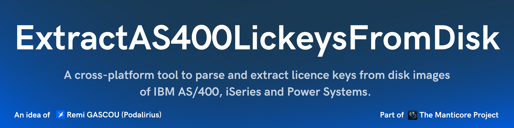

<p align="center">
      A cross-platform tool to parse and extract licence keys from disk images of IBM AS/400, iSeries and Power Systems. 
      <br>
      <a href="https://github.com/TheManticoreProject/ExtractAS400LickeysFromDisk/actions/workflows/release.yaml" title="Build"></a>
      
       
      <br>
</p>

> [!WARNING]
> 
> ---
>
> This tool is a forensic technique used to recover lost or forgotten licence keys from your own IBM AS/400, iSeries, or Power Systems.
> 
> It does not allow anyone to generate licence keys or bypass the licence validation mechanism. The original licence keys must already be present on your system's disks.
> 
> This tool is intended solely for recovery of licence information from systems you own or are authorized to administer.
> Use on systems without proper authorization may violate applicable laws or licence agreements.
>
> You can use this tool on production systems, but at your own risk.
>
> All licence keys and system serial numbers shown below are fictitious and used solely for demonstration purposes.
> 
> ---

## Features

- [x] Extracts licence keys from raw disk images.
- [x] Multiple output formats:
    - [x] Outputs the licence keys in ADDLICKEY control language commands in a file
    - [x] Outputs a JSON file containing the licence keys and their details.
- [x] Successfully tested on:
    - [x] IBM AS/400e running V5R1M0
    - [x] IBM iSeries running V5R4M0
    - [x] IBM Power 9 running V7R5M0 TR6

## Demonstration

Here is an example of how to use the tool to extract licence keys from a raw disk image from the 17Gb disk of an IBM AS/400 9406-170:

```bash
./ExtractAS400LickeysFromDisk --input "./disk.raw"
```


### Control Language Commands output

The `addlickey.cl` file will contain the following commands:

```bash
ADDLICKEY PRDID(5722SS1) LICTRM(V5R1M0) FEATURE(5050) SERIAL(237BD8F) PRCGRP(*ANY) LICKEY(14776E 9C1D2B 587C57) USGLMT(TODO) EXPDATE(TODO) VNDDTA(TODO)
ADDLICKEY PRDID(5722SS1) LICTRM(V5R1M0) FEATURE(5050) SERIAL(237BD8F) PRCGRP(*ANY) LICKEY(14776E 9C1D2B 587C57) USGLMT(TODO) EXPDATE(TODO) VNDDTA(TODO)
ADDLICKEY PRDID(5722QU1) LICTRM(V5R1M0) FEATURE(5050) SERIAL(237BD8F) PRCGRP(P05) LICKEY(E096D6 0032B2 65B7EF) USGLMT(TODO) EXPDATE(TODO) VNDDTA(TODO)
ADDLICKEY PRDID(5722QU1) LICTRM(V5R1M0) FEATURE(5050) SERIAL(237BD8F) PRCGRP(P05) LICKEY(E096D6 0032B2 65B7EF) USGLMT(TODO) EXPDATE(TODO) VNDDTA(TODO)
```

### JSON output

The `lickeys.json` file will contain the following data:

```json
{
    "237BD8F": {
        "5722QU1": {
            "V5R1M0": {
                "5050": [
                    {
                        "feature": "5050",
                        "lickey": "E096D60032B265B7EF",
                        "lictrm": "V5R1M0",
                        "name": "Query",
                        "prcgrp": "P05",
                        "prdid": "5722QU1",
                        "serial": "237BD8F",
                        "structure_data": "C335373232515531563552314D3035303530203233374244384650303530303030304A39393939393939202020202020202045303936443630303332423236354237454630303030303030303030303030202020202020202020202020202020202020202020202020202020202020"
                    },
                    {
                        "feature": "5050",
                        "lickey": "E096D60032B265B7EF",
                        "lictrm": "V5R1M0",
                        "name": "Query",
                        "prcgrp": "P05",
                        "prdid": "5722QU1",
                        "serial": "237BD8F",
                        "structure_data": "00A470D9BD00101030313300000001100000000035373232515531563552314D3035303530000000FFFFFFFFFFFFFFFF000000000000000000012A4F50535953202020202020202020202020202020202020202020202020202020202020202020202020202020202020202020202020202020202020202020202020202020202020202020202020202020202020202020202020202020202020202020204E00D689D864AABEC3000000000000000000453039364436303033324232363542374546FFFFFFFFFFFFFFFF20202020202020202032333742443846503035"
                    }
                ]
            }
        },
        "5722SS1": {
            "V5R1M0": {
                "5050": [
                    {
                        "feature": "5050",
                        "lickey": "14776E9C1D2B587C57",
                        "lictrm": "V5R1M0",
                        "name": "i5/OS",
                        "prcgrp": "999",
                        "prdid": "5722SS1",
                        "serial": "237BD8F",
                        "structure_data": "011830561E00121030323300000001100000000035373232535331563552314D3035303530000000FFFFFFFFFFFFFFFF00000000000000000000202020202020202020202020202020202020202020202020202020202020202020202020202020202020202020202020202020202020202020202020202020202020202020202020202020202020202020202020202020202020202020202020202020204E00D688C0A945D000000000000000000000313437373645394331443242353837433537FFFFFFFFFFFFFFFF20202020202020202032333742443846393939"
                    },
                    {
                        "feature": "5050",
                        "lickey": "14776E9C1D2B587C57",
                        "lictrm": "V5R1M0",
                        "name": "i5/OS",
                        "prcgrp": "999",
                        "prdid": "5722SS1",
                        "serial": "237BD8F",
                        "structure_data": "C335373232535331563552314D3035303530203233374244384639393930303030304A39393939393939202020202020202031343737364539433144324235383743353730303030303030303030303030202020202020202020202020202020202020202020202020202020202020"
                    }
                ]
            }
        }
    }
}
```

## Usage

```
$ ./ExtractAS400LickeysFromDisk -h
ExtractAS400LickeysFromDisk - by Remi GASCOU (Podalirius) @ TheManticoreProject - v1.0.0

Usage: ExtractAS400LickeysFromDisk [--debug] [--chunk-size <int>] [--workers <int>] --input <string> [--output-cl <string>] [--output-json <string>]

  --debug         Debug mode. (default: false)

  Configuration:
    -c, --chunk-size <int> Chunk size in bytes for reading the file (default: 100MB). (default: 104857600)
    -w, --workers <int>    Maximum number of worker threads (default: number of files). (default: 32)

  Input:
    -i, --input <string> Path(s) to the disk image file(s) to scan. Can be specified multiple times.

  Output:
    -c, --output-cl <string>   Output file for control language ADDLICKEY commands (default: ./addlickey.cl). (default: "./addlickey.cl")
    -j, --output-json <string> Output file for JSON output (default: ./lickeys.json). (default: "./lickeys.json")
```

## Building the project

To build the project, use the following Docker command in this directory:

```bash
docker run -v $(pwd):/workspace/ podalirius/build-go-project
```

Or, if you want to build it manually, you can use the following commands:

```bash
GOOS=linux GOARCH=amd64; mkdir -p "/workspace/bin/linux/${GOOS}/${GOARCH}/" && /usr/local/go/bin/go build -o "/workspace/bin/linux/${GOOS}/${GOARCH}/ExtractAS400LickeysFromDisk" -buildvcs=false
```

## Contributing

Pull requests are welcome. Feel free to open an issue if you want to add other features.
